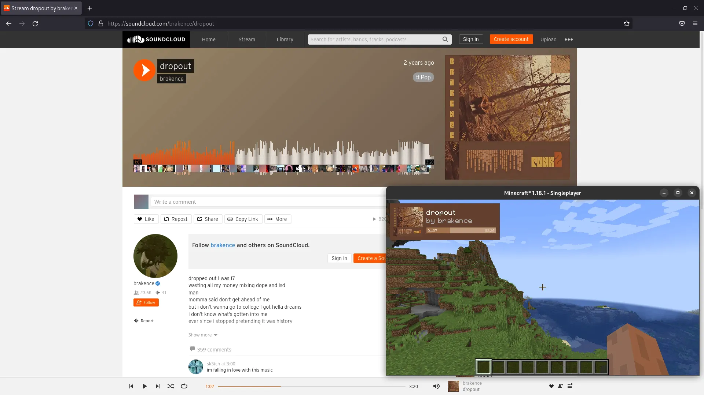

# MediaMod Browser Extension

The browser extension (for Chrome and Firefox) to provide MediaMod Integration with sites like YouTube and Soundcloud.

**More documentation & an actual README coming soon**

### Supported websites

**Implemented:**

- YouTube (`*.youtube.com/watch?v=*`)
- SoundCloud (`*.soundcloud.com/*`)

**Planned:**

- Bandcamp (`*.bandcamp.com/*`)
- Apple Music (`music.apple.com/*`)

## License

[LGPL 3.0](https://choosealicense.com/licenses/lgpl-3.0/)
